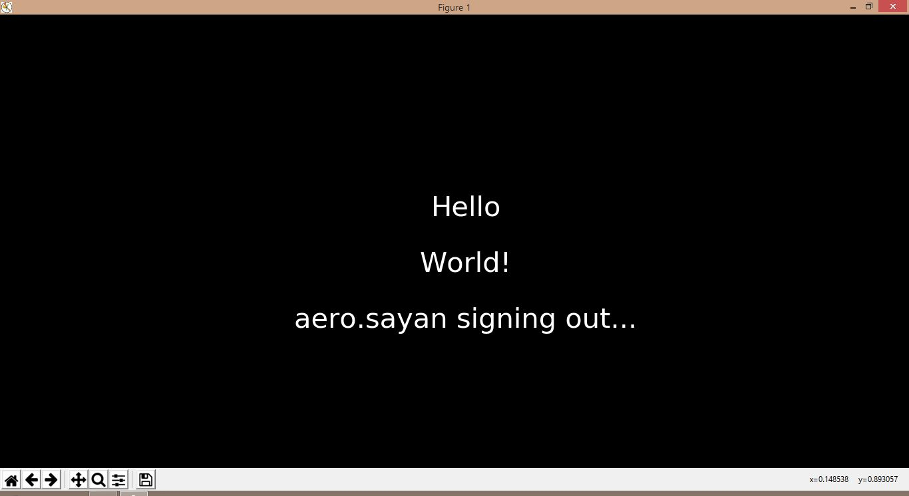

# ATHENA
<i>Named after the greek godess of wisdom.</i>
 
Designed to allow rendering mathematical tutorial
video frames. 
Input will be LaTex code, output will be rendered image that can be used to create educational videos.

Created for the upcoming highly anticipated Machine Learning series by me called  <b>10 Zen Days of Machine Learning </b> #10ZenDaysOfML  

## Author   : Sayan Bhattacharjee
## Email    : aero.sayan@gmail.com
## LinkedIn : www.linkedin.com/in/aerosayan/
#### License : DEFAULT forever, will make it GPL v2
#### SAMPLE RESULT :

## And more to come...
