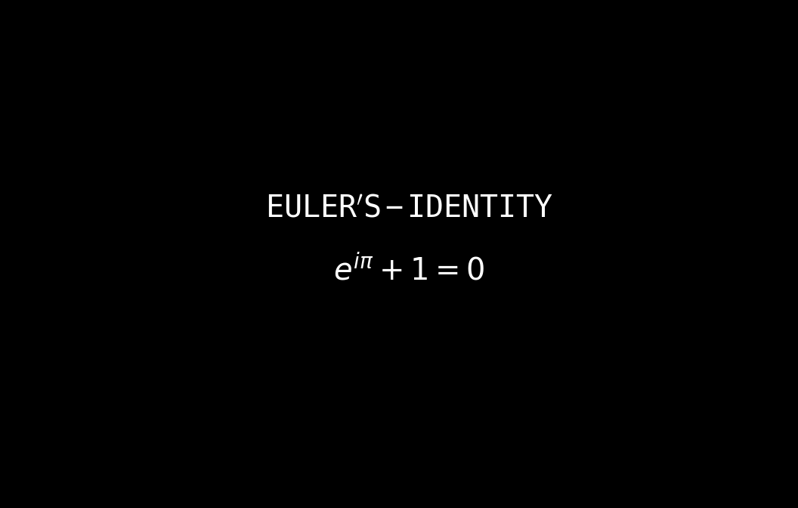
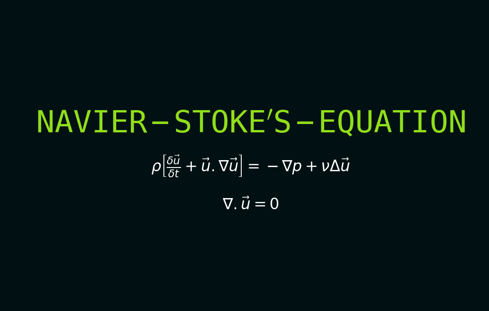
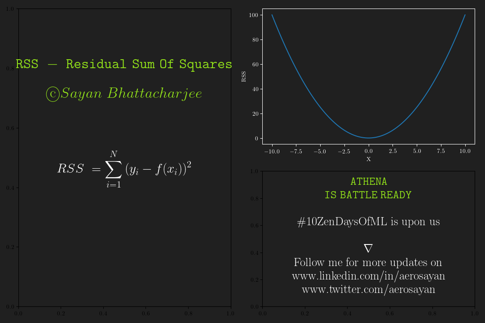

# ATHENA
<i>Named after the Greek Goddess of wisdom.</i>
 
Designed to allow rendering mathematical tutorial
video frames. 
Input will be LaTex code, output will be rendered image that can be used to create educational videos.

Created for the upcoming highly anticipated Machine Learning series by me called  <b>10 Zen Days of Machine Learning </b> #10ZenDaysOfML  

## Author   : Sayan Bhattacharjee
## Email    : aero.sayan@gmail.com
## LinkedIn : www.linkedin.com/in/aerosayan
#### License : DEFAULT for now, will make it GPL v3 soon

#### SAMPLE RESULTS :
Fig 1 : Euler's identity to show LaTex rendering

Fig 2 : Navier's stokes equation to show color rendering and font size

Fig 3 : ATHENA is ready for full production use

## And more to come...
